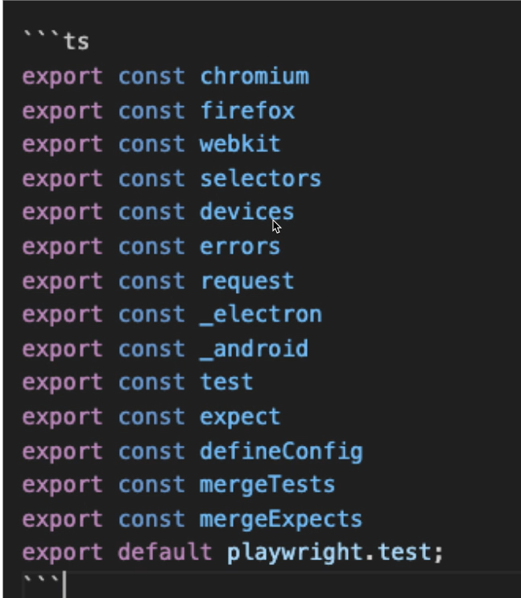

## Basic codes
1. npm init playwright@latest --> To Install
2. npx playwright --help --> To get all commands
3. npx playwright tests --> to run all tests from test folder
4. npx playwright install --> Resolve the browser download issue
5. npx playwright test mytest.spec.ts --headed --project=chrome
6. npx playwright test --help
7. npm run demo --> used to run scripts without giving whole path of folder.
    Just define in package.json file inside script while files u want to run 
    scripts{
        "demo" : "npx playwright test tests/demo/mytest.spec.ts --headed"
    }

## Git Commands to commit locally
1. git init
2. git status
3. git add .
4. git commit -m "<commit-message>"

## Git commands to push code to Remote Repo
1. git branch -M main
2. git remote add origin https://github.com/vasavi-QAAP/Playwright_E2E_Automation.git
3. git remote -v
4. git push -u origin main

## Common errors while running/writing scripts
1. Spelling mistake for spec.ts OR test.ts 
2. Some Application take more time to load on launching URL. To avoid use below in config file
    use{
        navigationTimeout: 30_0000 //30 sec
    }
3. When we avoid using `await` for any of the action

## URL: https://playwright.dev/docs/
## points to Remember
1. Own built-in Test Runner(No external runners like Mocha, Jest, Jasmine)
2. Powerful Config file(Controls overall test settings incl browsers, reporters, parellel runs)
3. test, expect, request some of most used functions
 --> Most used imports from playwright runner.
4. test() function 
    - test(title, body)
    - test(title, details, body)
    eg: test("should do something", {tag : "@smoke"}, async({page}, testInfo) => {})
5. Rule of Fixtures --> DRY Principle --> Don't repeat yourself
    - A page is a fixture from playwright runner's perspective, which is passed as an arg to the test object.
6. page.locator() and page.getBy...() return a locator object that represents a web element and enables auto-waiting and actions like .click() or .fill().
7. The expect() function takes an actual value (like a page, locator, string,number, Object , Array) and returns context-aware matcher assertions based on that value's type.
8. The await keyword pauses execution in an asynchronous function until a Promise resolves, ensuring test steps run sequentially (1, 2, 3)
 - await used before every "page" or "locator"(Eg: Click() and fill()... etc).
 - await before "expect" methods.

## Codegen benefits
1. Records test flow and generates best locators.
2. Reduces test writing time drastically
3. No more brittle/flaky selectors
4. 'Record at cursor'- Enables adding locators in the middle of test flow.

 